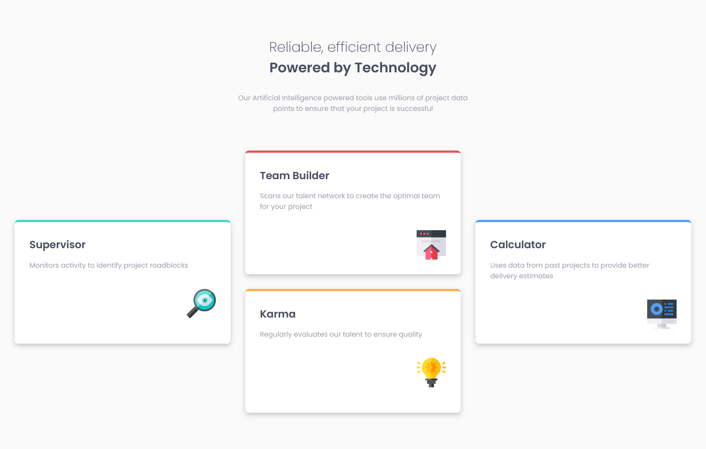
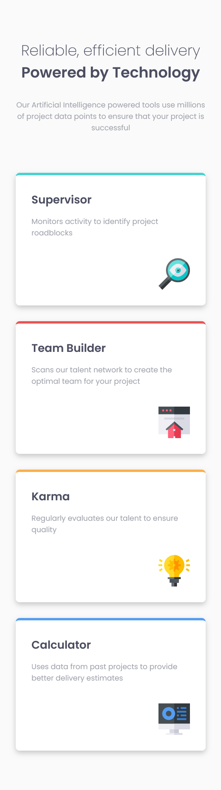

# Frontend Mentor - Four card feature section solution

This is a solution to the [Four card feature section challenge on Frontend Mentor](https://www.frontendmentor.io/challenges/four-card-feature-section-weK1eFYK). Frontend Mentor challenges help you improve your coding skills by building realistic projects. 

## Table of contents

- [Frontend Mentor - Four card feature section solution](#frontend-mentor---four-card-feature-section-solution)
  - [Table of contents](#table-of-contents)
  - [Overview](#overview)
    - [The challenge](#the-challenge)
    - [Screenshots](#screenshots)
    - [Links](#links)
  - [My process](#my-process)
    - [Built with](#built-with)
    - [What I learned](#what-i-learned)
  - [Author](#author)

## Overview

### The challenge

Users should be able to:

- View the optimal layout for the site depending on their device's screen size

### Screenshots

Desktop

Mobile

### Links

- Solution URL: (<https://github.com/ChaudharyPradip/FrontendMentor_four-card-feature-section>)
  
- Live Site URL: (<https://fm-four-card-feature-section-sol.netlify.app/>)

## My process

### Built with

- Semantic HTML5 markup
- CSS custom properties
- CSS Grid
- Mobile-first workflow

### What I learned

There was not much to learn in this project as it wasn't that much hard. Although I did learn one thing that if you have good SVGs then you don't need to write extra code to setup your images properly, they work perfectly out of the box.

## Author

- Website - [Pradip Chaudhary](https://www.your-site.com)
- Frontend Mentor - [@ChaudharyPradip](https://www.frontendmentor.io/profile/ChaudharyPradip)
- Twitter - [@thePradiptalks](https://www.twitter.com/thePradiptalks)
